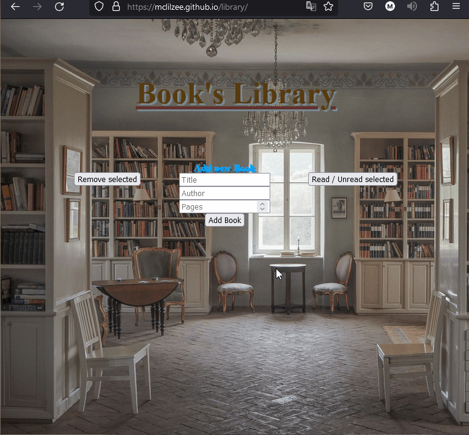
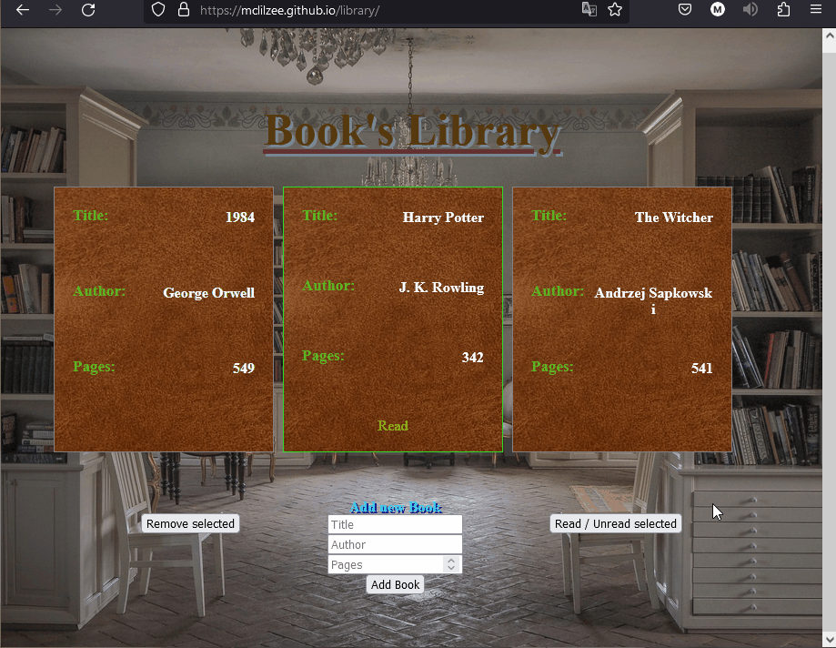

# <a href="https://mclilzee.github.io/library/">Library</a>
Library webpage where you will be able to add, delete, mark as read all kinds of book that you wish to be inside the library itself.
There isn't much to explain, the examples will show more of how the functionality work, make sure to check the web-page by clicking the title above.

# Example

### Adding Book

### Removing Book

### Marking Books as read

# Credit

### Background Photo
<a href="https://unsplash.com/@fromsky?utm_source=unsplash&utm_medium=referral&utm_content=creditCopyText">Lawrence Chismorie</a> on <a href="https://unsplash.com/s/photos/library-background?utm_source=unsplash&utm_medium=referral&utm_content=creditCopyText">Unsplash</a>

### Book Cover
<a href="https://unsplash.com/@felipesantana?utm_source=unsplash&utm_medium=referral&utm_content=creditCopyText">Felipe Santana</a> on <a href="https://unsplash.com/s/photos/leather-background?utm_source=unsplash&utm_medium=referral&utm_content=creditCopyText">Unsplash</a>
